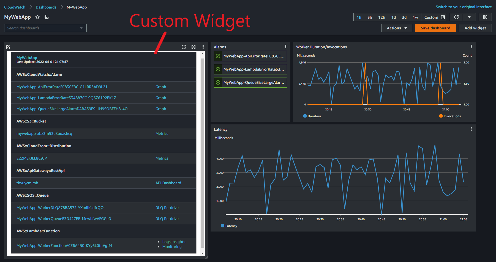

# Sample: CloudFormation Stack Summarizer

This repository demonstrates how to create a CloudWatch dashboard widget that
provides an HTML summary of one or more CloudFormation stacks. The summary lists 
important resources along helpful links to the AWS console. 



## Deploy the stack summarizer lambda function

The `deployment` directory contains a CDK app that deploys an AWS Lambda 
function named `CloudFormationStackSummarizer`. This function can be selected
when creating a [custom widget in a CloudWatch dashboard](https://docs.aws.amazon.com/AmazonCloudWatch/latest/monitoring/add_custom_widget_dashboard_create.html).

### Requirements
 - Docker CLI
 - AWS CDK CLI
 - Python >= 3.9
 - Pipenv - See [Pipenv Documentation](https://pipenv.pypa.io/en/latest/) for installation instructions
 - Valid AWS credentials

#### Before you start

Make sure your command line environment has valid AWS credentials set before you
begin. See the [AWS CLI Documentation](https://docs.aws.amazon.com/cli/latest/userguide/cli-configure-quickstart.html)
for information on configuring your environment.

This example assumes you can invoke Python as `python3`. If you do not have `python3` on your PATH. You may have 
trouble deploying the CDK applications in the example.

### Deploy 

```bash
cd deployment/
python3 -m pipenv install
cdk bootstrap
cdk deploy --all --require-approval never
```

## Deploy a sample dashboard with stack summary widget (CDK)

Once you have deployed the `CloudFormationStackSummarizer` lambda function, 
you can call it from a custom widget on a CloudWatch dashboard. The
`sample-usage-cdk` directory contains a sample CDK app that demonstrates
how use the summarizer widget in a CloudWatch dashboard.

### Deploy the CDK app

```bash
cd sample-usage-cdk
python -m pipenv install
cdk deploy --all --require-approval never
```

The link to your new dashboard will be printed to the console after the CDK a
app deploys. Follow this link to view the sample dashboard.

Sample output:
```
 ✅  SampleUsageCdkStack

✨  Deployment time: 20.95s

Outputs:
SampleUsageCdkStack.DashboardUrl = https://us-west-2.console.aws.amazon.com/cloudwatch/.....
```

### Clean up

When you're finished with the demo, you can clean up the sample dashboard with 
the following commands.

```bash
cdk destroy --all
```

## Deploy a sample dashboard with stack summary widget (CloudFormation only)

Once you have deployed the `CloudFormationStackSummarizer` lambda function, 
you can call it from a custom widget on a CloudWatch dashboard. The
`sample-usage-cfn` directory contains a sample CloudFormation template that
demonstrates how use the summarizer widget in a CloudWatch dashboard.

### Requirements
- AWS CLI

### Deploy the CloudFormation stack

```
cd sample-usage-cfn
aws cloudformation create-stack --template-body file://StackSummaryWidget.template.yml --stack-name DashboardWithStackSummary
```

Once deployed, navigate to CloudWatch and click "Dashboards" to view the
sample dashboard.

### Clean up

When you're finished with the demo, you can clean up the sample dashboard with 
the following commands.

```
aws cloudformation delete-stack --stack-name DashboardWithStackSummary
```

## Contents of this Repository

### summarizer-lambda/

This `summarizer-lambda/` directory contains Python code that runs as an AWS 
Lambda function. It accepts one or more CloudFormation stack names as input. It
returns an HTML summary of each stack. The rendered output is designed to be
used as a CloudWatch dashboard widget. 

### deployment/

The `deployment/` directory contains a CDK application that deploys the 
`summarizer-lambda` code as an AWS Lambda function named 
`CloudFormationStackSummarizer` to your AWS account.

### sample-usage-cdk/

The `sample-usage-cdk/` directory contains a sample CDK app that deploys a 
CloudWatch dashboard with a custom widget that invokes the `summarizer-lambda`
to render its contents.

### sample-usage-cfn/

The `sample-usage-cfn/` directory contains a sample CloudFormation template
that deploys a CloudWatch dashboard with a custom widget that invokes the
`summarizer-lambda` to render its contents.
